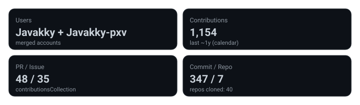
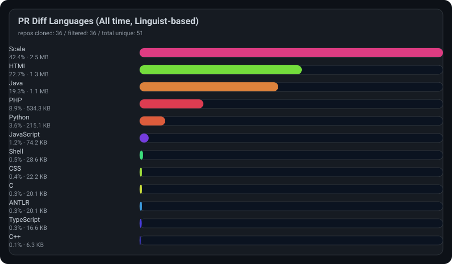
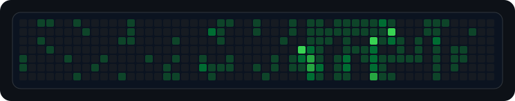

# Hi 👋 I'm Javakky

Backend Engineer / Scala / PHP / Java
PR diff languages are calculated **from PR changes (add+del)** using **GitHub Linguist**.

---

<!-- PROFILE_AUTOGEN:START -->

## 🧠 PR Diff Languages (All time, Linguist-based)

### Repo filters

- users: Javakky + Javakky-pxv
- exclude forks: yes (except allowlist)
- fork allowlist: `play-swagger/play-swagger`
- exclude archived: yes
- exclude orgs: (none)
- repos: 53 -> 38 (cloned: 38)

### Languages (Linguist, aggregated from cloned repos)

raw breakdown

- Scala: 42.6% (2.5 MB)
- HTML: 22.5% (1.3 MB)
- Java: 19.2% (1.1 MB)
- PHP: 8.9% (537.3 KB)
- Python: 3.6% (215.1 KB)
- JavaScript: 1.2% (74.2 KB)
- Shell: 0.5% (33.1 KB)
- CSS: 0.4% (22.2 KB)
- C: 0.3% (20.1 KB)
- ANTLR: 0.3% (20.1 KB)
- TypeScript: 0.3% (16.6 KB)
- C++: 0.1% (6.3 KB)

### Activity (merged heatmap)

updated: `2026-05-07T00:42:23.827Z`

<!-- PROFILE_AUTOGEN:END -->

---

## 📊 GitHub Stats (merged accounts)

<!-- 2アカの “数値” を合算して見せる用（言語は上の自前集計が本命） -->

 

<!-- streak は1アカ表示が安定（どちらか好きな方） -->

---

## 🧩 Summary

  

